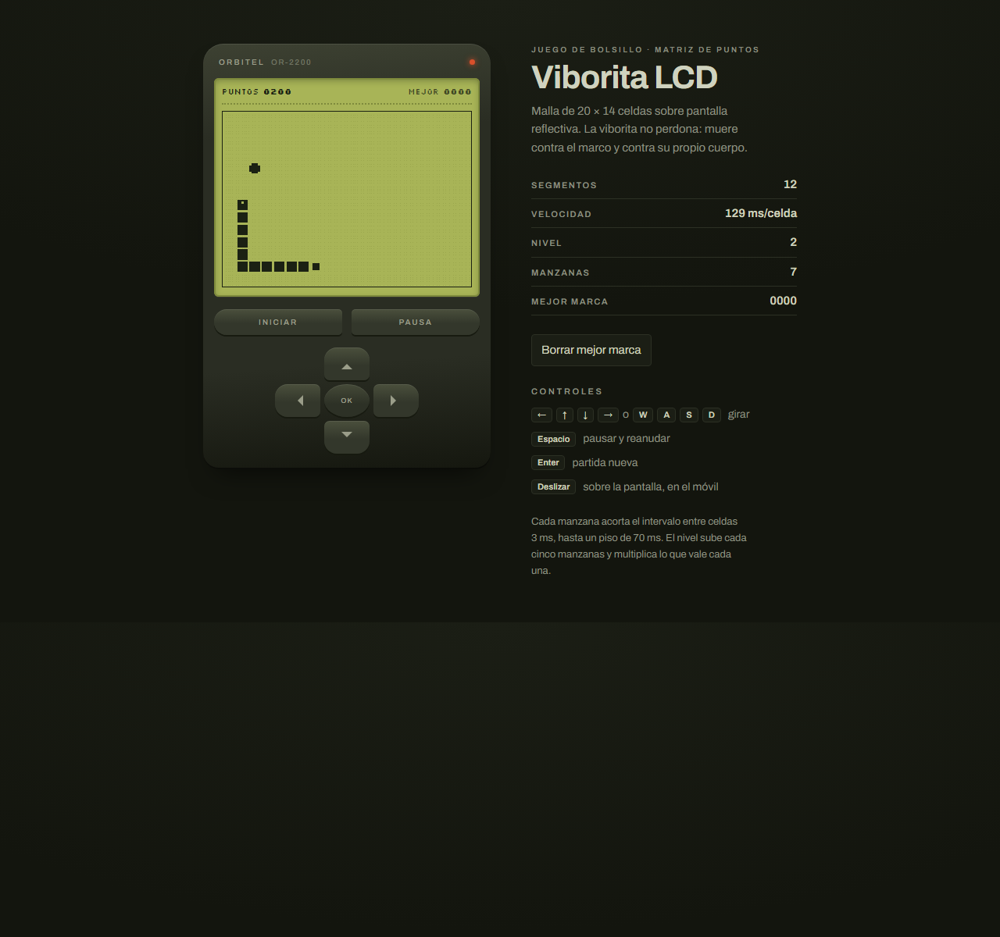
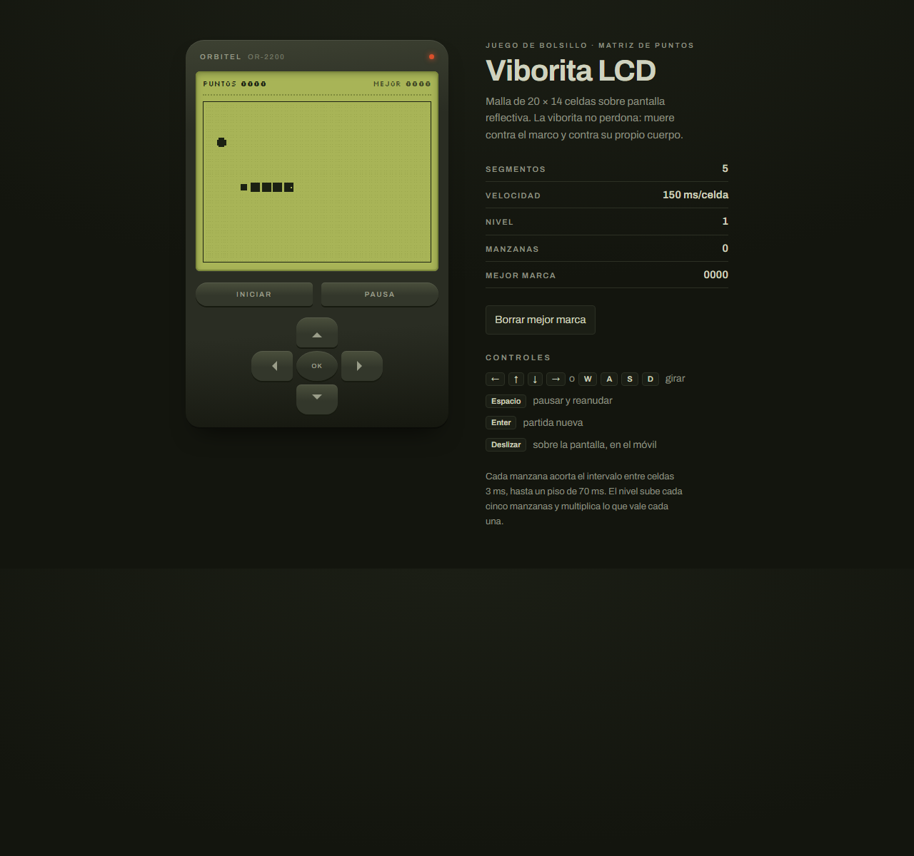

# Evidencias de desarrollo e integración — Viborita LCD

Fecha: 1 de octubre de 2026. Código integrado en `main`: `b942aaf`.

## 1. Autoría y trabajo en paralelo

Todos los commits tienen únicamente a **alexander <alexa@ALEX>** como autor y
confirmador. Sus mensajes no contienen trailers `Co-authored-by`.

Cada cambio se implementó en paralelo mediante una sesión real de OpenCode,
partiendo de `3ab88b5`, en una rama y un worktree independientes:

| Cambio | Rama | Worktree utilizado | Sesión OpenCode | Commit |
|---|---|---|---|---|
| Borrar mejor marca | `feat/borrar-record` | `.worktrees/borrar-record` | `ses_f081dd46fffeioxunNmryLrUDb` | `19d9f20` |
| Manzana dorada | `feat/manzana-dorada` | `.worktrees/manzana-dorada` | `ses_f081dcd7fffeufoWjebFXI4Thd` | `6bc55d7` |
| Racha | `feat/racha` | `.worktrees/racha` | `ses_f081dc7fdffecHbTF0YhSRtz4G` | `0201d36` |

Las tres sesiones finalizaron correctamente; no hubo fallos del proveedor.

## 2. Revisión de las ramas antes de confirmar los cambios

Antes de crear cada commit se revisaron `git status --short`, `git diff` y
`git log --oneline -10`. También pasaron `node --check game.js`,
`git diff --check` y las pruebas funcionales en Microsoft Edge.

| Rama | Archivos revisados y propósito | Comprobaciones principales | Aserciones aprobadas |
|---|---|---|---:|
| `feat/borrar-record` | `index.html`: botón debajo de la tabla; `styles.css`: presentación del botón; `game.js`: confirmación y borrado. | Aceptar/cancelar; actualizar ambos indicadores y almacenamiento; Enter/Espacio sin reiniciar ni pausar; reajustar el reloj tras el diálogo; almacenamiento bloqueado. | 134 |
| `feat/manzana-dorada` | `game.js`: identificación, sprite hueco y puntuación triple. | Frutas 7/14/21; normales 6/8; identificación antes de incrementar `manzanas`; nivel actualizado; contorno y ausencia de parpadeo comprobados con píxeles del canvas. | 1280 |
| `feat/racha` | `game.js`: contador de movimientos y puntuación doble. | Primera sin bonus; 15 pasos dan ×2 y 16 dan ×1; consumo tardío establece una nueva referencia; pausa no cuenta; cuatro pasos por frame cuentan cuatro movimientos. | 161 |

Los commits se crearon después de estas comprobaciones. Para inspeccionar el
resultado exacto de cada revisión:

```powershell
git show 19d9f20 -- game.js index.html styles.css
git show 6bc55d7 -- game.js
git show 0201d36 -- game.js
```

## 3. Integración en `main` y resolución del conflicto

Se integraron las ramas en este orden, con merges que conservan su historial:

| Orden | Rama | Commit de integración | Resultado |
|---:|---|---|---|
| 1 | `feat/borrar-record` | `b7e779b` | Sin conflictos. |
| 2 | `feat/manzana-dorada` | `1c4bde5` | Integración automática de `game.js`, sin conflictos. |
| 3 | `feat/racha` | `b942aaf` | Conflicto de contenido en `game.js`, resuelto conservando los dos factores. |

La tercera integración se inició con:

```powershell
git merge --no-ff --no-commit feat/racha
```

Git informó:

```text
Auto-merging game.js
CONFLICT (content): Merge conflict in game.js
Automatic merge failed; fix conflicts and then commit the result.
```

Ambas ramas modificaban la misma suma dentro de `paso()`: `main` aplicaba
`multiplicadorDorada`, mientras que la rama de racha aplicaba
`multiplicadorRacha`. Se combinaron las dos condiciones y se sustituyeron las
sumas alternativas por una sola que multiplica ambos factores.

### Bloque final que aplica la regla ×6

Código de `game.js`, dentro de `paso()`:

```js
if (cabeza.x === comida.x && cabeza.y === comida.y) {
  const dorada = (manzanas + 1) % 7 === 0;
  const multiplicadorDorada = dorada ? 3 : 1;
  const enRacha = ultimoPasoComida !== null && pasos - ultimoPasoComida <= 15;
  ultimoPasoComida = pasos;
  const multiplicadorRacha = enRacha ? 2 : 1;
  manzanas += 1;
  nivel = Math.floor(manzanas / MANZANAS_POR_NIVEL) + 1;
  puntos += 10 * nivel * multiplicadorDorada * multiplicadorRacha;
  tickMs = Math.max(MS_MINIMO, MS_INICIAL - manzanas * MS_POR_MANZANA);
  comida = celdaLibre();
} else {
  cuerpo.pop();
}
```

La séptima manzana corresponde al nivel 2: su valor base es `10 × 2 = 20`.
Sin racha suma `20 × 3 = 60`; con racha suma **`20 × 3 × 2 = 120`**.
La resolución se verificó en el navegador antes de confirmar el merge.

## 4. El juego funcionando con los tres cambios

La ejecución integrada pasó **1977 aserciones, con cero fallos**, en Microsoft
Edge `154.0.4258.37`. El registro incluye los estados del juego, las
confirmaciones, los hashes de los archivos comprobados y la verificación de
que `index.html`, `styles.css` y `game.js` no fueron modificados por las pruebas:
[verificacion-main.json](evidencias/verificacion-main.json).

Las primeras tres capturas son un escenario reproducible: se prepara la fruta
y se controla el avance de los frames mediante instrumentación temporal en la
respuesta HTTP. El juego ejecuta sus movimientos, crecimiento, puntuación y
confirmación originales. La cuarta captura ejecuta el código original sin
instrumentación ni sustitución del bucle de animación.

### Séptima manzana dorada, hueca y visible

Se consumieron seis manzanas separadas por 16 movimientos: hay 80 puntos,
11 segmentos y nivel 2. La fruta pendiente es la séptima y se dibuja hueca,
incluso en el instante en que una manzana normal estaría apagada.


### Dorada consumida en racha: incremento de 120 puntos

La séptima se consume un movimiento después de la sexta. La puntuación pasa de
80 a **200**, y la viborita crece a 12 segmentos. El incremento es **120 = ×6**.


### Borrado de récord con la partida conservada

Después de aceptar la confirmación real, ambos indicadores muestran `0000` y
`localStorage["viborita-lcd.mejor"]` contiene `"0"`. Se conservan los 200 puntos,
las siete manzanas y los 12 segmentos de la partida.



### Ejecución original en marcha

Partida iniciada en el navegador, con el bucle de animación original y el
botón de borrar récord visible. La captura se tomó tras 500 ms de juego.
Para ejecutarlo localmente, abrir `index.html` en el navegador.



## 5. Eliminación de los worktrees

Antes de eliminarlos, `git status --short` no mostró cambios en ninguno de los
tres worktrees. Los siguientes comandos finalizaron con código 0, confirmando
que todas las ramas estaban integradas:

```powershell
git merge-base --is-ancestor feat/borrar-record main
git merge-base --is-ancestor feat/manzana-dorada main
git merge-base --is-ancestor feat/racha main
```

Se eliminaron mediante Git, sin forzar la operación:

```powershell
git worktree remove ".worktrees/borrar-record"
git worktree remove ".worktrees/manzana-dorada"
git worktree remove ".worktrees/racha"
```

Después se comprobó que `.worktrees` estaba vacía y se eliminó también esa
carpeta. Las cuatro comprobaciones siguientes devolvieron `False`:

```powershell
Test-Path -LiteralPath ".worktrees/borrar-record"  # False
Test-Path -LiteralPath ".worktrees/manzana-dorada" # False
Test-Path -LiteralPath ".worktrees/racha"          # False
Test-Path -LiteralPath ".worktrees"                # False
```

`git worktree list --porcelain` mostró únicamente el repositorio principal:

```text
worktree D:/Programacion Comercial/alexander_emiliano_mendez_lopez_202308018
HEAD b942aaf104ed93e9a33a75e8e0310f51430ccf79
branch refs/heads/main
```

Esta salida se capturó después de la limpieza y antes de confirmar este informe.
Las ramas se conservaron; los worktrees y sus carpetas ya no existen.

## 6. Historial de integración

Resultado de `git log --all --graph --oneline --decorate` tras la limpieza,
antes del commit que añade este informe:

```text
*   b942aaf (HEAD -> main) integrar racha y combinar multiplicadores de puntuación
|\
| * 0201d36 (feat/racha) agregar puntuación doble por racha de manzanas
* |   1c4bde5 integrar manzanas doradas
|\ \
| * | 6bc55d7 (feat/manzana-dorada) agregar manzanas doradas con puntuación triple
| |/
* |   b7e779b integrar borrado de mejor marca
|\ \
| |/
|/|
| * 19d9f20 (feat/borrar-record) agregar botón para borrar mejor marca
|/
* 3ab88b5 agregar guía y excluir worktrees locales
* bcdb6ad (origin/main) agregar los archivos
```

`git branch --merged main` confirmó las cuatro ramas:

```text
  feat/borrar-record
  feat/manzana-dorada
  feat/racha
* main
```

Para ver el historial completo actualizado, incluido el commit de las evidencias,
y comprobar su autoría:

```powershell
git log --all --graph --oneline --decorate
git log --all --format="%h | autor: %an <%ae> | confirmador: %cn <%ce>%n%B"
git worktree list
```
